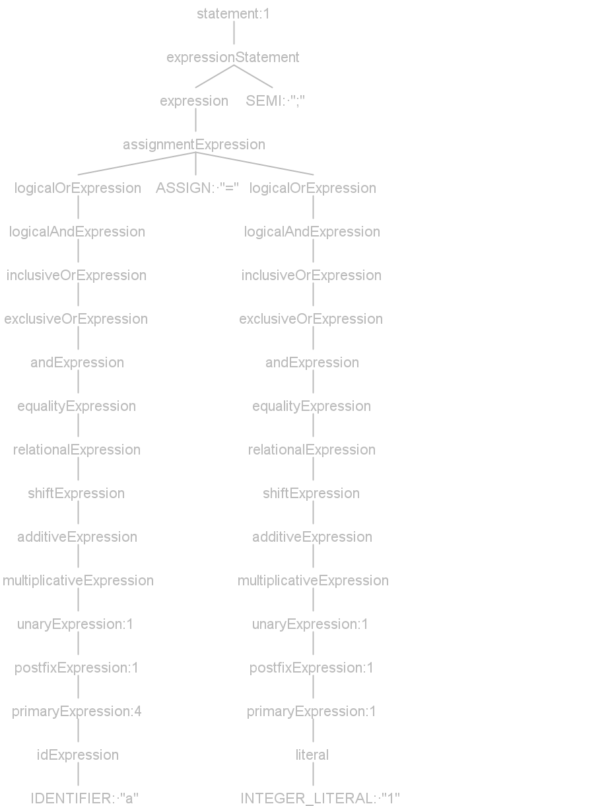

# Mid-Semantic

## Git Repo

Compiler repo at [here](https://github.com/Pioooooo/Mx_compiler)

## g4 Grammar

1. statement parse trees
    1. `a = 1;`

    2. `b = ++++a++ + 1;`

2. `++a` / `--a`: unaryExpression;

   `a++` / `a--`: postfixExpression.

3. `AContext.b()`

    1. `BContext`

    2. `List<BContext>`

    3. `List<BContext>`

## AST Node

1. Ast Structure

<!--digraph G {
    x1, x2, x3, x4 [label="x"];
    block1, block2 [label="block" shape=box];
    condition1, condition2 [label="condition"];
    if, while, continue, break [shape=box];
    if -> condition1 -> "==";
    if -> block1 -> {"while", "continue"};
    "==" -> {x1, "2"}
    "while" -> condition2 -> "!=";
    "while" -> block2 -> {"=", "break"}
    "!=" -> {x2, "3"}
    "=" -> {x3, "+"};
    "+" -> {x4, "1"}
}-->

2. ExprStatement is a Statement that contains an expression.
